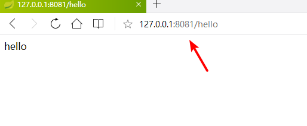

#### 使用Spring Initializer快速构建生成

会自动给我们生成一些目录和相关配置文件

### 1、IDEA：使用 Spring Initializer快速创建项目

IDE都支持使用Spring的项目创建向导快速创建一个Spring Boot项目；

选择我们需要的模块；向导会联网创建Spring Boot项目；

默认生成的Spring Boot项目；

- 主程序已经生成好了，我们只需要我们自己的逻辑
- resources文件夹中目录结构
  - static：保存所有的静态资源； js css  images；
  - templates：保存所有的模板页面；（Spring Boot默认jar包使用嵌入式的Tomcat，默认不支持JSP页面）；可以使用模板引擎（freemarker、thymeleaf）；
  - application.properties：Spring Boot应用的配置文件；可以修改一些默认设置；
  
  # 二、配置文件
  
  ## 1、配置文件
  
  SpringBoot使用一个全局的配置文件，配置文件名是固定的；
  
  •application.properties
  
  •application.yml
  
下一节重点学习一个配置文件相关
在application.properties中改一下端口

